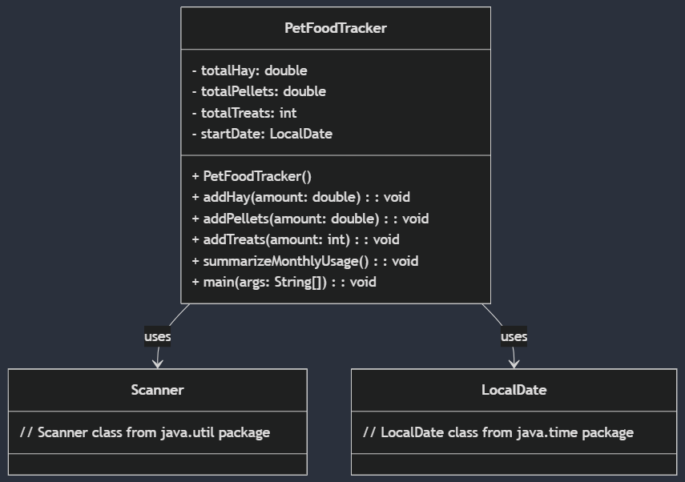

## Pet Food Tracker
Team Name: Pet Tracker
Members: Jacob Gaffke

## What is the Pet Food Tracker?

The Pet Food Tracker will be a program that lets you input the amount of hay (in oz), pellets (in oz), and treats (in units; 1 treat = 1 unit). The program will take the values you input and keep a running total of what you have used for each. This program will also give a summary of how much of each you used in the last month.

## Why I'm Making This Program and What the Pet Food Tracker is Useful for

I'm creating the Pet Food Tracker since my family has a pet rabbit at our home. We buy the food she needs through a subscription service on Amazon that requires you to input the frequency that the food arrives at. With this program, we would be able to keep track of how much food we give to our rabbit in a month and use that information to determine how often we should recieve food for her. If not using a subscription service like that, this program would still be useful for determining roughly how often you would need to buy food for a pet rabbit.

## How the Program Will be Used

To use the Pet Food Tracker, you would simply input how much for each food category you used that day into their respective boxes. Then, you would click submit and the totals you inputted would be added to the running total that would be displayed for each food category. You would also be able to click a button prompt that lets you display the monthly total of food used for each food category.

## Plan and Estimation of Effort

My plan to make this Pet Food Tracker project is to first work on making the functional program of the project. Completing the program should take a good amount of effort in order to create and polish. After finishing the program, I'll then move on to creating the user interface for the program. This part of the project will most likely take more effort since I will have to work on coming up with a design for the user interface for it to look nice. On top of that, I will have to program the various parts of the planned interface, including text descriptions and prompts, areas to input data, and separate buttons to let you submit your data to add to the current data and view the monthly usage data. I plan to space out this work throughout the month to put less strain on myself for completing this project by the due date.

## UML Class Diagram

